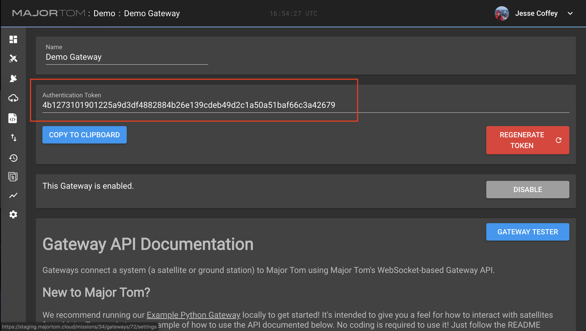

# KubOS Python Gateway for Major Tom

*Note:* The gateway is currently in Beta, and is not well documented.
Please [submit an issue](https://github.com/kubos/kubos-gateway/issues/new) or
[come talk to us on Slack](https://slack.kubos.com) if you have any problems!

# First Time Setup

### Check Python Compatibility
The KubOS gateway requires Python 3.7+.
You can check your current version of Python by running:
`python --version` or `python3 --version` depending on your environment.
Whichever command (`python` or `python3`) results in a version that complies will be what you use for the rest of the command line instructions.
We will be using `python3` in the examples.

### Setup Python Virtualenv
Assuming you have the Gateway files on your machine, you'll need to run the following commands from the base folder of the Gateway:

```shell
sudo apt-get install python3-venv
python3 -m venv virtualenv
source virtualenv/bin/activate
pip3 install -r requirements.txt
```

*Note:* deactivate the virtualenv by running:
```shell
deactivate
```

### Build Client Binaries:
The KubOS gateway requires the shell and file clients to interact with their respective KubOS services.
You need to build these clients and save them locally for the gateway to use.
Instructions for building the clients:

  1. Clone [KubOS repository](https://github.com/kubos/kubos/) locally.
  1. Navigate to the base directory of the repository (we'll refer to it at the `kubos` directory)
  1. From that directory, run `cargo build --bin kubos-{SERVICE}-client`, for example:

  ```
  cargo build --bin kubos-file-client
  cargo build --bin kubos-shell-client
  ```

  1. That will place the client binary here: `kubos/target/debug/kubos-{SERVICE}-client`. Leave the client binary there or move it to a location of your choice for the gateway to access. You'll need the full path for the next section.

### Setup Gateway Config File
Copy the contents of the `gateway_config.toml` into a new file titled `gateway_config.local.toml` for local config
and then update the file to match your system settings.
Here are the required config fields and their description:

- `satellite`:
  - `name` name of the satellite in Major Tom
  - `ip` overrides the IP address in the KubOS config toml, and can be one of the following:
    - The IP of device on your network running KubOS
    - Localhost for your machine if you're running services locally
    - The IP of the ground communications services tunneling IP to the spacecraft running KubOS
  - `config-path` is the *local* path to the KubOS config `toml` matching the KubOS system you are attempting to communicate with.
    - To retrieve from the spacecraft, it is typically located at: `/etc/kubos-config.toml`
    - You can also use the [example in the kubos repo](https://github.com/kubos/kubos/blob/master/tools/local_config.toml), located at: `$kubos-repo/tools/local_config.toml`
  - `file-list-directories`is an array of directories you want to retrieve the contents of for potential downlink or just viewing in Major Tom.
    - The directories in the `gateway_config.toml` are the ones we suggest will be most useful to retrieve from KubOS, feel free to add/remove as needed.
- `client-binaries`: Paths to the clients built in the previous section.
  - `file-client` local path on your machine to the built file client binary from the KubOS repository.
  - `shell-client` local path on your machine to the built shell client binary from the KubOS repository.


### Retrieve Major Tom Connection Info
We highly recommend running the gateway (`run.py` file) with the `-h` flag to see what all command line options are available:
```shell
source virtualenv/bin/activate
python3 run.py -h
```
Most users will only need the Major Tom Hostname and Gateway Authentication Token.
The Major Tom Hostname is the URL or IP you enter to access Major Tom (eg: app.majortom.cloud).
The Gateway Authentication Token is found by logging in to Major Tom and opening the page of the Gateway you wish to connect to:



Retrieve these from your instance of Major Tom.
If your deployment of Major Tom requires a BasicAuth login before your user login,
you'll also need to provide those credentials to the gateway with the `-b` optional argument.

# Running the Gateway
To run the Gateway, execute these commands,
replacing `{MAJOR TOM HOSTNAME}` and `{GATEWAY TOKEN}` as appropriate:

```shell
source virtualenv/bin/activate
python3 run.py {MAJOR TOM HOSTNAME} {GATEWAY TOKEN}
```

Example usage:

```shell
python3 run.py app.majortom.cloud 16b9c3e2cb4b9faf3s252aa402985f5d2471f70304ada3efd673b411d1b7afes
```

After running the gateway, you can deactivate the virtualenv by running:
```shell
deactivate
```

# Using the Gateway
This section is still in progress, and will be expanded with future releases of the KubOS gateway.
If you have any questions on how to use the gateway and how to interact with KubOS,
we recommend you come [talk to us on Slack!](https://slack.kubos.com)
Until we expand this section further,
we recommend looking at the commands that become available in Major Tom when you connect the gateway,
as it will automatically upload all commands it supports.

# Feedback
Please feel free to [open issues](https://github.com/kubos/kubos-gateway/issues) or email us at open-source@kubos.com to report bugs or request new features!
